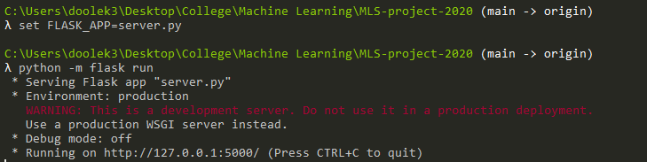

# Machine Learning & Statistics Tasks 2020
Tasks 2020 Assessment by Kevin Dooley

### Background
This repository contains the completed Machine Learning and Statistics Project 2020. The project is worth 50% of the total marks for this module. All aspects of this project are contained in a git repository and submitted up to Moodle prior to the project deadline on the 08th January 2021.

Git must be used document your work and marks will be awarded under the following headings: Research, Development, Consistency and Documentation.

The project description is detailed in full on the GMIT Moodle page under the 'Project 2020 Assessment' PDF.

### Overview of Project
To create a web service that uses machine learning to make predictions based on the data set `powerproduction` which is saved in this repository.  The goal is to produce a model that accurately predicts wind turbin epoweroutput from windspeed values, as in the data set.  You must then develop a web service that will respond wit hpredicted power values based on speed values sent as HTTP requests.

The project mus contain the below as a minimum:
1. Jupyter  notebook  that  trains  a  model  using  the  data  set.
2. Python script that runs a web service based on the model, as above.
3. Dockerfile to build and run the web service in a container.
4. Standard items in a git repository such as a README.


### Getting Started
1. If not already installed, download and install Python 3.
2. Recommend downloading Python via the Anaconda download to get useful additional software including Jupyter and iPython. By downloading Anacoda you will also get essential packages such as; NumPy, Pandas, SciPy already built into Python. All of are used within this project.
3. Download and install a command prompt - recommend Cmder (Windows) or Terminal (Mac).
4. To run this Jupyter notebook on your computer you will need to download the `Project 2020.ipynb` file to your desktop. To do this copy the url https://github.com/kevindooley/MLS-project-2020 which will bring you to the repository. Click the green `Code` button on the screen and then copy the link under the `HTTPS` tab. On the command line, enter `git clone`, paste the url and hit enter. This will then clone the Github repository onto your desktop in your current working directory. 
5. Once cloned/downloaded to your desktop, open your command line
6. Using the 'cd' command on your command line, go to the directory you cloned the .ipynb file to.
7. Type `jupyter notebook` or `jupyter lab` into the command line to open up Jupyter. The Jupyter notebook will then open up in your browser and click on the `Tasks 2020.ipynb` file to view the Jupyter notebook. Note: If your browser does not open with the notebook, go to the command line and it will say `To access the notebook, open this file in a browser:/Or copy and paste one of these URLs:`. Copy one of the provided URLs and paste into a browser of your choosing. The Jupyter homepage containing `Project 2020.ipynb` should be shown on your screen. 
8. All cells should be completed and already executed but if you wish to re-run the cells, click the `Kernel` button and then the `Restart & Clear Output` button if you wish to clear all executions and run each cell one by one manually or click `Restart & Run All` if you want to clear all executions and re-run all cells again automatically.
9. To end viewing of the Jupyter notebook, close your browser showing the notebook. Go to the command line and press `CTRL + C` which will terminate the notebook viewing. 
9. You can also view the Jupyter notebook directly on Github by clicking on the link to my repository https://github.com/kevindooley/MLS-project-2020. All commits to this repository can be viewed on Github.
10. Sometimes, the Jupyter notebook does not always load on Githib, you can also view on nbviewer using the link https://github.com/kevindooley/MLS-project-2020

### Running Virtual Environment
To run this repository you will need certain modules or packages. These are all contained in the requirements.txt file in this repository. To load them onto your virtual machine, follow the below:
1. Open the virtual environment `python -m venv venv`
2. Load the requirements.txt to the virtual environment `pip install -r requirements.txt`
3. Use `pip freeze` to see the packages now installed on your virtual environment.

### Run the server
1. Enter the below onto your command line. This will run the flask server.
```
set FLASK_APP=rando.py
python -m flask run
```
2. To check that connection has been made with the server, run `curl -i http://localhost:5000/` on a new command console. Do not run the above curl on the same console as the flask server. 
3. To access the server, go to your browser of choice and copy in the following url `http://localhost:5000/`. This will bring you directly to the web page that will predict generated power from the wind speed model.


### Docker
See `Getting Started` above to clone respository and download docker from https://www.docker.com/get-started
Assuming you have the respository on your desktop and docker now installed, follow the below steps.

1. Enter `docker --version` on command line to confirm docker is downloaded on desktop.
2. On command line, enter `docker build . -t project-app` . This will build a docker image of your repository, in the current directory. The image contains all designs for your container to run - it is sort of like the schematics.
3.On command line, enter `docker run --name project-container -d -p 5000:5000 project-image` 
4. You can now run the container

### Python Packages used in this project
1. NumPy is a package for Python for scientific computing. It supports large, multidimensional arrays and matrices, meaning it has a wide array of applications specifically used to generate pseudo arrays and do simulations. 
2. SciPy is a Python-based open-source library for scientific computing and mathematics. It contains modules that support optimisation, linear algebra, integration and inerpolation. 
3. Seaborn is a high-level Python data visualisation library used for making attractive and informative statistical plots. It acts as a wrapper over matplotlib, and it’s used in conjunction with NumPy and pandas data structures
4. Matplotlib similar to seaborn is a toolkit used the visualisation of data. Matplotlib is a Python 2D plotting library which produces publication quality figures in a variety of hardcopy formats and interactive environments across platforms.
5. Keras  is a powerful and easy-to-use free open source Python library for developing and evaluating deep learning models. It allows you to define and train neural network models in just a few lines of code utilising the Theano and TensorFlow libraries.
6. Tensorflow is an open source library for numerical computation and large-scale machine learning. It can be used across a range of tasks but has a particular focus on training and inference of deep neural networks. It allows us to build models and serve us in ways which wernt possible before as it removes the need for heavy manual logic.
7. Docker is an application build and deployment tool. It enables developers to package applications into containers—standardized executable components that combine application source code with all the operating system (OS) libraries and dependencies required to run the code in any environment. Basically, you can package your code with dependencies into a deployable unit called a container and that container can then be run on any environment. 
